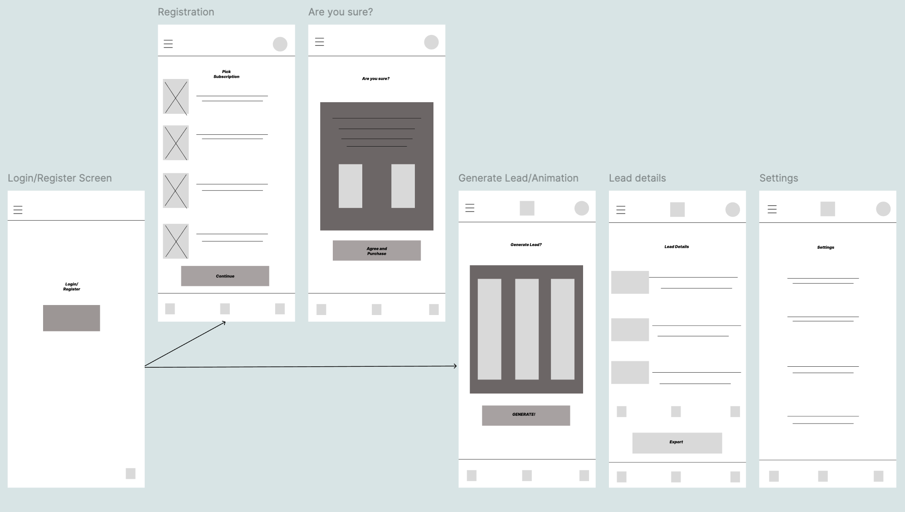

# Real Estate Lead Generator App

## What This App Does

This is a real estate app that helps agents find people who might want to buy or sell houses. The app looks at life events like getting married, divorced, or retiring to find potential customers. You sign up for an account, spin a slot machine to generate leads, and get contact info for people who might need a realtor. The app gives you their phone number, email, address, and property value so you can reach out. It tracks how many leads you can generate based on your subscription plan.

## Wireframes

These show what each screen looks like and how you move through the app from logging in to getting lead details.

## Design Choices

### Android Design

I followed Google's Material Design guidelines for the Android version. I used blue (#2196F3) as the main color because it looks professional and trustworthy for real estate. The text sizes follow Material Design's type scale so everything looks consistent and is easy to read. I set up spacing using an 8dp grid system with consistent values throughout the app - 4dp for tiny spaces up to 32dp for big sections. The slot machine has smooth spinning animations and the buttons have nice shadows and feedback when you tap them. Cards group related information together and have subtle elevation to show they're interactive. Everything lines up properly and follows Material Design's layout principles.

### iPhone Design

For iPhones, I made sure it follows Apple's design rules while keeping the same features as Android. The navigation feels like other iPhone apps with familiar swipe gestures and transitions. The text automatically gets bigger or smaller based on what users set in their iPhone accessibility settings. When the app needs permission to access contacts or phone, it asks the way iPhone users expect. All the buttons are big enough to tap easily (44pt minimum like Apple requires), and I adjusted the colors to work better with iOS's lighter design style. The status bar and safe areas are handled properly so it looks like it belongs on iOS, but the core slot machine and lead generation stuff works exactly the same.

## What's Inside

- **Lead generation**: Creates fake but realistic lead profiles with names, contact info, and property details
- **Phone features**: 
  - Tap to call phone numbers directly
  - Tap to send emails through your email app
  - Copy lead info to clipboard for pasting elsewhere
- **Account system**: Login, registration, and credit tracking for how many leads you can generate
- **Slot machine interface**: Fun spinning animation that generates your leads
- **Cross-platform**: Works on both Android and iPhone with proper design for each